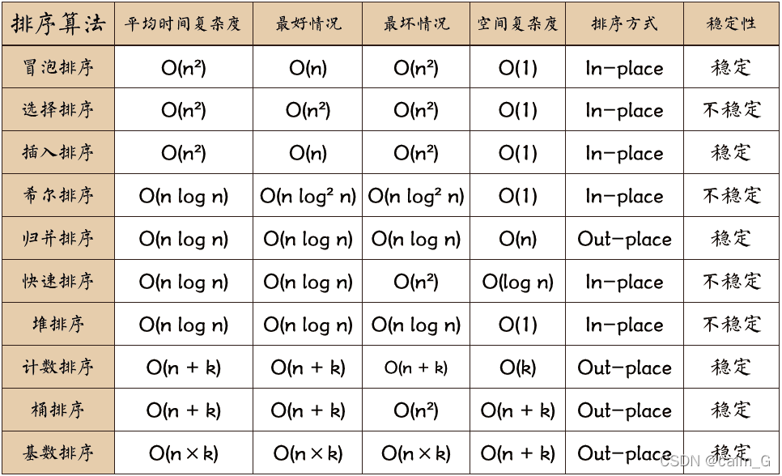

# 排序



---

# 比较排序

## 选择排序

### 基本思想

每一趟从待排序的数据元素中选出最小的（或者是最大的）的一个元素，顺序放在有序数列的最前（或最后）直到全部待排序的数据元素排完。

| 稳定性 | 平均时间复杂度 | 最坏时间复杂度 | 最优时间复杂度 | 空间复杂度 |
| --- | --- | --- | --- | --- |
| 不稳定 | \\(O(N^2)\\) | \\(O(N^2)\\) | \\(O(N^2)\\) | \\(O(1)\\) |

```cpp
// select_sort(a, n)

void select_sort(int a[], int n) {
    for (int i = 0; i < n; i++) {
        int min = i;
        for (int j = i + 1; j < n; j++) {
            if (a[j] < a[min]) {
                min = j;
            }
        }
        if (min != i) {
            swap(a[min], a[i]);
        }
    }
}
```
## 冒泡排序

### 基本思想

每一趟排序中比较相邻数据是否逆序，如果逆序则交换两者。这样一轮下来最大的数据将冒泡到最后的位置，无序数据规模则变为了\\(n - 1\\)。经过\\(n - 1\\)轮排序后所有数据有序

| 稳定性 | 平均时间复杂度 | 最坏时间复杂度 | 最优时间复杂度 | 空间复杂度 |
| --- | --- | --- | --- | --- |
| 稳定 | \\(O(N^2)\\) | \\(O(N^2)\\) | \\(O(N)\\) | \\(O(1)\\) |

```cpp
// bubble_sort(a, n)

void bubble_sort(int a[], int n) {
    bool flag = false;
    // 这里i > 0 于 i >= 0 一致
    for (int i = n - 1;  i > 0; i--) {
        for (int j = 0; j < i; j++) {
            if (a[j] > a[j + 1]) {
                flag = true;
                swap(a[j], a[j + 1]);
            }
        }
        if (!flag) {
            break;
        }
    }
}
```

## 插入排序

[动态演示](https://www.cs.usfca.edu/~galles/visualization/ComparisonSort.html)

### 基本思想

在已排好序的序列中寻找待排序元素的位置，并执行插入动作。需要注意的是在插入时需要将插入位置后的所有元素后移一位。

| 稳定性 | 平均时间复杂度 | 最坏时间复杂度 | 最优时间复杂度 | 空间复杂度 |
| --- | --- | --- | --- | --- |
| 稳定 | \\(O(N + k)\\) | \\(O(N^2)\\) | \\(O(N + k)\\) | \\(O(n + k)\\) |

```cpp
// insert_sort(a, n)

// 伪插入排序，小的冒泡的冒泡排序
void insert_sort_cp(int a[], int n) {
    for (int i = 0; i < n - 1; i++) {
        for (int j = i + 1; j >= 1; j--) {
            if (a[j] < a[j - 1]) {
                swap(a[j], a[j - 1]);
            } else {
                break;
            }
        }
    }
}

// 插入排序
void insert_sort(int a[], int n) {
    for (int i = 0; i < n; i++) {
        int j = i - 1;
        for (j; j >= 0; j--) {
            if (a[j] < a[i]) {
                break;
            }
        }
        if (j != i - 1) {
            int tmp = a[i];
            int k = i - 1;
            for (k; k > j; k--) {
                a[k + 1] = a[k];
            }
            a[k + 1] = tmp;
        }
    }
}
```

---

# 其他排序算法

## 桶排序

### 基本思想

所有待排序的元素在一个明显的有限范围内，可以设计有限个有序桶，将待排序的元素装入对应的桶内，桶号就是待排序的元素，顺序输出则得到有序的序列。

| 稳定性 | 平均时间复杂度 | 最坏时间复杂度 | 最优时间复杂度 | 空间复杂度 |
| --- | --- | --- | --- | --- |
| 稳定 | \\(O(N^2)\\) | \\(O(N^2)\\) | \\(O(N)\\) | \\(O(1)\\) |

```cpp
// 桶的个数
int const N = 100010;
void bucket_sort(int a[], int n) {
    int B[N];
    for (int i = 0; i < n; i++) {
        B[a[i]]++;
    }
    // 输出排序后的序列
    for (int i = 0; i < N; i++) {
        while (B[i]-- > 0) {
            cout << i << " ";
        }
    }
}